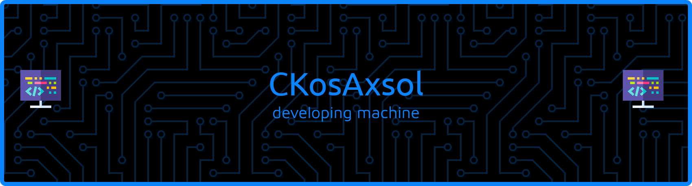

  

# 🐧 Hi there
*I automate things so that other things do not explode.*

## 🤨 Who I Am
- PLC developer with more professional experience than I care to admit
- I build IoT systems that do what they are supposed to do, and sometimes even more
- I feed the cloud with data so dashboards can stay happy

---

## 👨‍💻 What I Do
- **Collect data** from anything that blinks, beeps, or communicates over serial
- **Automate** everything that does not actively fight back
- **Build libraries** so other people have fewer reasons to swear
- **CI/CD?** Of course. Even for PLCs.
  (Yes, you *can* automate that. No, I do not do it voluntarily.)

---

## 🧰 Toolbox
- PLCs, IoT, edge controllers
- Cloud communication (for dashboards with emotional stability)
- Git, CI/CD pipelines, versioning magic

---

## 📬 Contact
... unavailable, send me a ticket

## Coding Tools
<!-- Programming & Tools -->

<!-- Scripting -->

<!-- Communication & Industrial Interfaces -->

<!-- DevOps / Deployment -->

